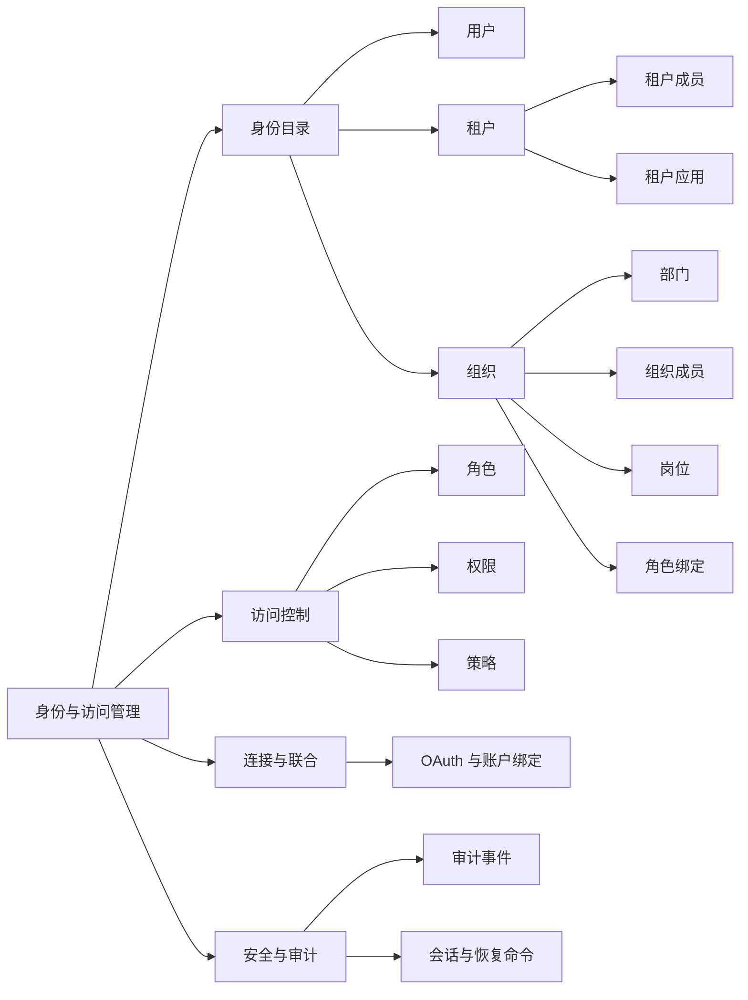

# SDKWork IAM 管理后台产品设计与优化报告

> 版本：1.0  
> 日期：2026-07-21  
> 范围：用户、租户、组织、部门、成员、岗位、角色与权限、密码恢复及管理员基础能力

## 1. 执行摘要

本轮优化把 IAM 管理后台从“资源接口的页面化展示”推进到“适合持续运营的企业身份管理工作台”。设计基线不是单纯增加按钮，而是围绕四项企业 IAM 核心原则展开：最小权限、清晰上下文、可审计变更、服务端规模化检索。

已经完成的关键改进如下：

- 用户目录支持服务端搜索、分页、只读详情和用户 CRUD 精确授权。
- 当前用户中心与管理员后台分离，个人密码修改只作用于当前身份。
- 忘记密码采用标准验证式恢复流程，避免管理员直接设置他人密码。
- 租户目录新增服务端搜索，并对租户 CRUD、租户成员读写删实施逐项权限控制。
- 组织管理重构为“组织目录 + 当前组织上下文 + 分域标签页”，部门、成员、岗位、角色绑定不再同时堆叠。
- 组织目录新增服务端搜索；组织、部门、成员及只读子域按真实 IAM 权限控制。
- 只读管理员可以查看目录和详情，但行点击不会隐式进入编辑状态。
- 页面内动作统一使用 IAM 通配感知权限判定，`iam.*` 等合法范围授权与路由、菜单行为保持一致。
- 新增组织管理中英文资源，移除硬编码英文和异常占位字符。

当前最大的剩余风险不是前端表现，而是部分高价值管理员命令尚无后端契约，例如“发送密码重置邀请”“下次登录强制改密”“撤销指定用户全部会话”。这些能力必须先由 IAM 后端提供独立、可审计、可授权的 command，再进入 UI。

## 2. 产品目标与边界

### 2.1 产品目标

1. 让平台管理员能够快速找到身份对象，并在正确的租户、组织上下文中完成操作。
2. 让只读、用户管理员、组织管理员、安全管理员等职责通过权限自然分离。
3. 让所有高风险操作具备明确意图、二次确认、后端审计和可追踪失败信息。
4. 让列表能力在大规模数据下仍使用服务端搜索与分页，而不是把全量数据下载到浏览器。
5. 让用户自助流程与管理员流程分离，降低凭据暴露和越权风险。

### 2.2 非目标

- 不在前端伪造后端不存在的管理员命令。
- 不允许管理员直接读取、生成或设置用户明文密码。
- 不通过原始 HTTP、手写认证头或本地 DTO 绕过 IAM SDK。
- 不在本轮变更数据库结构或迁移。
- 不把租户、组织、部门视为可互换概念：租户是隔离边界，组织是租户内运营结构。

## 3. 用户角色与核心任务

| 角色 | 核心任务 | 默认权限原则 |
| --- | --- | --- |
| 平台只读审计员 | 查看用户、租户、组织、授权目录及审计记录 | 全部只读，不出现变更入口 |
| 用户管理员 | 创建、更新、禁用用户，发起安全恢复动作 | 不自动获得租户、组织和策略管理权限 |
| 租户管理员 | 维护租户资料、成员和租户应用 | 仅管理授权租户范围，不具备平台级策略能力 |
| 组织管理员 | 维护组织、部门和成员关系 | 不自动获得用户凭据、全局角色和租户删除权限 |
| 授权管理员 | 管理角色、权限、策略和范围化绑定 | 不自动获得用户资料和租户生命周期权限 |
| 安全管理员 | 查看审计、处理会话和账户安全事件 | 高风险命令单独授权并强审计 |
| 当前用户 | 维护个人资料、修改自己的密码 | 只能作用于当前会话主体 |

## 4. 目标信息架构

组织工作台内部采用渐进披露：先搜索并选择组织，再按“部门、成员、岗位、角色绑定”切换。该结构避免多张大表同时加载，也能让每个标签页独立遵循读取权限。

## 5. 关键流程设计

### 5.1 用户查找与管理

1. 管理员使用姓名、用户名、邮箱、手机号等条件执行服务端搜索。
2. 结果按标准分页返回，目录行点击进入只读详情。
3. 编辑、删除等操作使用独立入口，并由 `iam.users.*` 权限控制。
4. 删除必须二次确认；敏感字段遵循掩码与最小展示原则。
5. 用户中心使用 IAM app SDK；管理员目录使用 IAM backend SDK，两个边界不混用。

### 5.2 租户管理

1. 通过名称、编码或 ID 搜索租户。
2. 选择租户后进入该租户上下文，查看应用；拥有成员读取权限时才显示成员标签页。
3. 租户 CRUD、成员增改删、租户应用配置分别授权。
4. 搜索条件在列表刷新和加载更多时保持一致。
5. 只读管理员仍可进入详情，但不会因为点击成员行而打开编辑抽屉。

### 5.3 组织管理

1. 通过名称、编码或 ID 搜索组织。
2. 点击“查看详情”只选择组织，不进入编辑状态。
3. 详情标签页只展示当前会话有读取权限的域，并且只加载当前标签页数据。
4. 部门和成员变更入口按资源级权限显示。
5. 岗位和角色绑定当前仅提供读取，因为现有控制器没有对应写命令。
6. 组织成员删除不展示，因为现有 IAM backend SDK 未提供该命令。
7. 组织结构使用独立动态路由，左侧维护部门树，右侧管理当前部门成员。
8. 部门成员支持服务端搜索、分页、从组织成员目录加入部门和设置主部门。

### 5.4 密码修改与重置

密码相关流程分为三类：

| 场景 | 推荐流程 | 当前状态 |
| --- | --- | --- |
| 当前用户知道旧密码 | 校验旧密码后修改，并按策略决定是否撤销其他会话 | 已实现当前用户修改密码 |
| 用户忘记密码 | 通过已验证邮箱或手机号发起恢复，使用一次性凭证设置新密码 | 已实现标准忘记密码流程 |
| 管理员协助恢复 | 发送重置邀请、强制下次登录改密、撤销会话 | 待后端提供独立 command |

明确禁止“管理员输入并设置用户新密码”。该模式会让管理员接触用户凭据，也难以证明最终使用者身份。成熟 IAM 的更安全做法是让管理员发起可审计的恢复动作，由用户在验证通道中设置只有本人知道的新密码。

建议的管理员恢复命令必须具备：

- 独立权限，例如 `iam.users.password_reset_invite.create`。
- 命令幂等键和频率限制。
- 操作者、目标用户、租户、原因、结果和追踪 ID 的审计记录。
- 一次性、短时效、绑定目标用户与用途的恢复凭证。
- 可选的“下次登录必须改密”和“撤销其他会话”。
- 不在 API 响应、日志或管理界面返回临时密码。

## 6. 权限与动作矩阵

| 资源 | 查看 | 创建 | 更新 | 删除/移除 | 当前 UI 状态 |
| --- | --- | --- | --- | --- | --- |
| 用户 | `iam.users.read` | `iam.users.create` | `iam.users.update` | `iam.users.delete` | 已逐项控制 |
| 租户 | `iam.tenants.read` | `iam.tenants.create` | `iam.tenants.update` | `iam.tenants.delete` | 已逐项控制 |
| 租户成员 | `iam.tenant_members.read` | `iam.tenant_members.create` | `iam.tenant_members.update` | `iam.tenant_members.delete` | 已逐项控制 |
| 租户应用 | 租户读取上下文 | `iam.tenant_applications.provision` | `iam.tenant_applications.update` | `iam.tenant_applications.enable` 控制启停 | 已逐项控制 |
| 组织 | `iam.organizations.read` | `iam.organizations.create` | `iam.organizations.update` | `iam.organizations.delete` | 已逐项控制 |
| 部门 | `iam.departments.read` | `iam.departments.create` | `iam.departments.update` | `iam.departments.delete` | 已逐项控制 |
| 组织成员 | `iam.memberships.read` | `iam.memberships.create` | `iam.memberships.update` | 后端未提供 | 仅展示真实能力 |
| 岗位 | `iam.positions.read` | 后端有权限但当前控制器无写方法 | 同左 | 同左 | 当前只读 |
| 角色绑定 | `iam.role_bindings.read` | 后端有权限但当前控制器无写方法 | 不适用 | 当前控制器无删除方法 | 当前只读 |
| 角色/权限/策略 | 各资源 `.read` | `.create` | `.update` | `.delete` | 已逐项控制 |

前端隐藏入口只是体验层防误操作，后端仍必须对每个请求执行同等权限校验和租户范围校验。

## 7. 行业对齐原则

本设计参考 Microsoft Entra ID、Okta、Auth0、Keycloak、AWS IAM Identity Center 等成熟产品共有的产品原则，而不是机械复制某一家界面：

1. **目录与详情分离**：大规模对象先检索，再进入上下文详情。
2. **最小权限与职责分离**：读取、创建、更新、删除及安全命令分别授权。
3. **渐进披露**：组织详情按域加载，减少认知负担和无权数据请求。
4. **安全恢复而非代设密码**：管理员发起恢复，用户通过验证通道设置密码。
5. **高风险动作显式化**：删除、禁用、会话撤销等动作需确认、原因和审计。
6. **范围优先**：授权必须明确平台、租户、组织或资源范围，避免隐式继承。
7. **可运营性**：服务端搜索、分页、稳定 ID、状态、追踪 ID 和错误反馈是一等能力。
8. **只读体验完整**：只读不是“按钮点了再报错”，而是可浏览、不可误入编辑。

## 8. 本轮实现明细

### 8.1 租户

- 新增名称、编码、ID 的服务端 `q` 搜索。
- 搜索结果继续使用标准 `page_size: 20` 会话和加载更多。
- 租户新增、编辑、删除分别受精确权限控制。
- 租户成员标签页和增改删分别受精确权限控制。
- 只读成员列表不再通过行点击进入编辑。

### 8.2 组织

- 将压缩且混杂的单页重构为可维护的 React 工作台。
- 新增组织服务端 `q` 搜索。
- 组织行点击改为选择详情，编辑使用独立图标按钮。
- 新增当前组织上下文头和部门、成员、岗位、角色绑定标签页。
- 标签页按读取权限显示，并按需加载，避免越权请求和无效并发。
- 组织、部门、成员的写操作按现有 controller 能力逐项控制。
- 新增 `/admin/iam/organizations/:organizationId/structure` 深链工作台，刷新后可按稳定组织 ID 恢复上下文。
- 新增左侧部门树和右侧部门成员目录，支持部门层级 CRUD、成员搜索与分页、加入部门和设置主部门。
- 新增 `zh-CN` 与 `en-US` 资源目录，消除硬编码和异常破折号文本。

### 8.3 Manager 集成

- Manager IAM 适配器把当前会话 permission scope 映射为租户和组织工作台显式能力。
- 权限目录读取者可独立发现 IAM 模块；组织结构深链继续要求组织、部门和分配三项读取权限全部满足。
- 角色、权限、策略目录以及 OAuth 运营工作台使用真实路由级懒加载，不再把 permission controller 和 OAuth SDK 编排带入首包。
- 根应用与 PC 应用清单声明本轮实际使用的 IAM 权限。
- 所有业务调用继续通过注入的 `SdkworkIamService` 和组合式 IAM backend SDK。

## 9. 风险与后端能力缺口

| 缺口 | 风险 | 处理原则 |
| --- | --- | --- |
| 管理员重置邀请命令缺失 | 无法安全协助用户恢复 | 先设计可审计 command，再实现 UI |
| 强制下次登录改密缺失 | 泄露响应后的补救链不完整 | 与账户状态和会话撤销统一设计 |
| 指定用户会话撤销缺失 | 高风险账户无法快速止损 | 独立权限、原因、审计、幂等 |
| 组织成员删除 SDK 方法缺失 | 成员生命周期不闭环 | 不展示伪操作，补齐 owner contract 后生成 SDK |
| 部门分配停用 operation 缺失 | 部门成员只能加入和更新，不能安全移出 | 权限目录已有 `iam.assignments.deactivate`，需先补 OpenAPI、服务和 SDK operation |
| 岗位写操作未进入当前控制器 | 组织岗位只能查看 | 先明确岗位 CRUD 产品语义与引用约束 |
| 角色绑定写操作未进入当前控制器 | 范围化授权无法在组织页闭环 | 设计主体、角色、范围选择器与冲突校验 |
| 批量操作缺失 | 大组织运营效率不足 | 需要异步任务、部分失败结果和审计导出 |

## 10. 路线图

### P0：安全与可用闭环

- 管理员发送密码重置邀请。
- 强制下次登录修改密码。
- 撤销指定用户全部或指定会话。
- 组织成员移除命令。
- 用户禁用/启用与会话撤销联动。
- 所有高风险命令要求原因、确认、追踪 ID 和审计事件。
- 目录搜索增加可复制稳定 ID、状态筛选和空结果复位。

### P1：授权与组织运营

- 组织树与部门树双视图，保留列表搜索作为主入口。
- 岗位 CRUD、部门成员移出/停用、岗位分配和组织角色绑定 CRUD。
- 用户详情聚合租户成员关系、组织成员关系、角色与有效权限来源。
- 权限变更影响预览，显示直接授权、角色继承、策略计算和范围。
- 批量邀请、批量禁用、批量成员调整，提供异步任务结果。
- 审计页面可从用户、租户、组织详情带上下文跳转。

### P2：高级治理

- 访问评审与定期再认证。
- 临时权限、审批流和到期自动回收。
- 职责冲突规则与高风险组合告警。
- 身份生命周期自动化和外部目录同步。
- 异常登录、权限提升、休眠高权账户风险视图。
- 管理动作 SLA、失败率和权限使用率分析。

## 11. 验收标准

### 功能验收

- 租户和组织搜索请求向 SDK 传递 `q`，不在浏览器对全量结果做过滤。
- 搜索、刷新和加载更多保持同一查询会话。
- 没有对应权限时，新增、编辑、删除入口不可见。
- 没有子域读取权限时，组织详情不显示对应标签页，也不发起对应请求。
- 行点击用于查看上下文；编辑必须通过明确操作触发。
- 所有删除操作需要确认，失败时保留上下文并展示可理解错误。
- 中英文资源键结构一致，不出现硬编码英文或异常编码文本。

### 工程验收

- IAM 租户包、组织包和 Manager IAM 适配包 TypeScript 检查通过。
- 新增权限与搜索测试以及既有租户应用、组织控制器回归测试通过。
- SDK consumer import、分页、国际化、应用清单和仓库验证器通过。
- Manager 生产构建通过，并完成桌面和移动宽度的溢出检查。
- 未修改 `sdks/**/generated/**`，未新增原始 HTTP 或手写认证头。

## 12. 成功指标

| 指标 | 建议目标 |
| --- | --- |
| 找到目标用户/租户/组织的中位时间 | 小于 15 秒 |
| 常规成员调整完成时间 | 小于 30 秒 |
| 因权限不足导致的前端失败请求 | 接近 0 |
| 高风险管理命令审计覆盖率 | 100% |
| 密码恢复中管理员接触明文密码 | 0 |
| 列表首屏请求数据量 | 固定分页，默认不超过 20 条 |
| 管理端关键流程可用性 | 99.9% 以上 |
| 批量任务部分失败可追踪率 | 100% |

## 13. 验证证据与已知环境限制

本轮已取得以下工程证据：

- IAM 租户包 TypeScript 检查通过。
- IAM 组织包 TypeScript 检查通过。
- Manager IAM 适配包 TypeScript 检查通过。
- IAM 组织包 3 个测试文件、6 个测试通过；Manager IAM 5 个测试文件、11 个测试通过，并保留租户相关回归覆盖。
- Manager 架构静态测试 28 个通过，包含 IAM 通配授权、permission catalog 懒加载和 OAuth 懒加载防回归。
- Manager 与 IAM 的 SDK consumer import、分页和国际化验证通过。
- Manager 根应用与 PC 应用清单验证通过。
- Manager 权限组合与 `verify-repo` 验证通过。
- Manager `pnpm verify` 全量通过，覆盖部署与拓扑校验、生产构建、API assembly、Rust 格式、Clippy 和工作区测试。
- Manager 生产构建通过，1007 个模块完成转换。
- IAM 懒加载治理消除了 `INEFFECTIVE_DYNAMIC_IMPORT` 告警，入口 chunk 从 `1270.41 kB / 304.58 kB gzip` 降至 `1216.20 kB / 292.95 kB gzip`。
- 未修改生成 SDK，目标源码中未新增原始 HTTP 或手写认证头。

当前环境限制和既有问题：

- IAM 仓库级 `verify-repo` 仍被 4 项既有 Rust 组件契约/工作区依赖问题阻断，与本轮前端文件无关。
- 共享工作区 frozen-lockfile 检查被 `sdkwork-core-pc-react` 中既有 Vite 版本不一致阻断；本轮锁文件只增加组织包所需的两个 importer，共 6 行。
- 本地 Manager 服务在桌面和移动宽度均无横向溢出，但 IAM 后端未运行，受保护路由重定向到 `/auth/login` 并停留在连接状态，因此已认证管理页面仍需在可用 IAM 环境做最终视觉验收。
- 全应用入口 chunk 仍大于 500 kB；IAM 已移除可识别的静态重依赖，剩余体积需要按 Manager 全模块依赖图继续治理。

## 14. 结论

SDKWork IAM 管理后台已经具备专业企业管理台的基础骨架：对象目录可检索、资源上下文清晰、权限与动作匹配、用户自助与管理员职责分离。下一阶段不应继续堆叠前端表单，而应优先补齐可审计的账户恢复、会话撤销、组织成员生命周期和范围化授权命令，使安全运营形成真正闭环。
