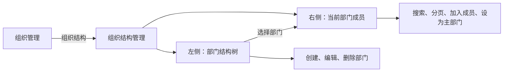

# IAM 组织结构管理产品设计

> 版本：1.0  
> 日期：2026-07-21  
> 适用页面：`/admin/iam/organizations/:organizationId/structure`

## 1. 产品定位

组织结构管理是具体组织下的二级管理工作台，负责维护部门层级，以及组织成员与部门之间的归属关系。

边界定义：

- 组织决定业务归属边界，组织结构不能脱离组织独立存在。
- 部门只能挂接在一个组织下，可形成多级父子结构。
- 部门成员必须先是该组织的成员，再通过 `departmentAssignments` 分配到部门。
- 一个组织成员可以加入多个部门，并可标记一个主部门。
- 用户账号、组织成员、部门成员是三个不同层级，页面不直接创建用户账号。

## 2. 入口与导航

主入口位于组织管理页：

1. 管理员进入“身份与访问 / 组织管理”。
2. 在组织行操作区点击“组织结构”，或先查看组织详情后点击“组织结构”。
3. 跳转到 `/admin/iam/organizations/:organizationId/structure`。
4. 页面根据路由中的稳定 `organizationId` 重新加载组织、部门树和首个部门成员，不依赖上一页临时状态。
5. 点击“返回组织管理”回到 `/admin/iam/organizations`。

该动态路由不显示在侧栏，因为组织结构必须从具体组织上下文进入，不能在缺少组织 ID 时成为全局入口。



## 3. 页面结构

### 3.1 桌面布局

```text
┌────────────────────────────────────────────────────────────────────┐
│ ← 返回组织管理                                                     │
│ SDKWork 的组织结构                                                  │
│ 管理 SDKWork 的部门层级和每个部门的成员归属                         │
├──────────────────────┬─────────────────────────────────────────────┤
│ 部门结构          ＋  │ 产品研发                    [搜索] [添加成员] │
│                      │                                             │
│ ▾ 总部               │ 成员       用户 ID      岗位   主部门  状态 │
│   ▾ 研发中心          │ Alice      user-1       负责人 ★      启用 │
│     产品研发          │ Bob        user-2       工程师 -      启用 │
│     基础平台          │                                             │
│   市场中心            │                              [加载更多]     │
│                      │                                             │
└──────────────────────┴─────────────────────────────────────────────┘
```

- 左栏宽度固定为约 320px，右栏占据剩余空间。
- 两栏属于一个连续工作区，不使用嵌套卡片。
- 部门树默认展开当前已加载层级，选中态必须清晰。
- 右侧标题始终显示当前选中部门，避免成员操作失去上下文。

### 3.2 移动布局

- 小屏幕改为上下排列，部门树位于成员列表之前。
- 部门树与成员列表保持相同选择语义，不缩放字号。
- 搜索和新增按钮允许换行，不产生横向页面滚动。
- 数据表内部可以使用受控横向滚动，但页面主体不得溢出。

## 4. 部门树交互

### 4.1 一级部门

点击部门树标题右侧的加号创建一级部门。表单字段包括：

- 名称：必填。
- 编码：选填，用于稳定业务识别。
- 上级部门 ID：一级部门为空。
- 状态：编辑时可维护。

### 4.2 下级部门

每个部门节点提供紧凑图标操作：

- 加号：在当前部门下创建下级部门。
- 编辑：修改部门名称、编码、上级和状态。
- 删除：打开危险确认框。

删除提示明确说明：如果部门仍有下级部门或成员关系，后端可能拒绝删除。前端不得静默级联删除组织结构数据。

### 4.3 选择部门

- 点击节点只切换当前部门并加载对应成员。
- 选择行为不打开编辑表单。
- 切换部门时清空上一部门成员，显示局部加载状态。
- 成员搜索条件在切换部门时重置，避免把上一部门过滤条件隐式带入。

## 5. 部门成员管理

### 5.1 成员列表

成员列表使用 IAM `departmentAssignments.list`，请求包含：

- `departmentId`：当前部门 ID。
- `q`：成员姓名或用户 ID 搜索词。
- `page_size: 20`：标准分页大小。
- `cursor` 或 `page`：由共享分页会话维护。

列表展示：

| 字段 | 产品含义 |
| --- | --- |
| 成员 | 优先显示姓名，其次显示用户 ID |
| 用户 ID | 稳定身份标识，可用于排障和审计 |
| 岗位 | 当前分配投影出的岗位名称；本轮只读 |
| 主部门 | 星标表示该成员的主部门 |
| 状态 | 部门成员关系状态 |

### 5.2 添加成员

1. 点击“添加部门成员”。
2. 在抽屉中搜索当前组织的成员。
3. 从组织成员菜单中选择目标成员。
4. 可勾选“设为主部门”。
5. 提交 `departmentAssignments.create`，请求使用 `departmentId`、`organizationMembershipId` 和 `isPrimary`。
6. 成功后关闭抽屉并刷新当前部门成员。

选择源必须是组织成员目录，不允许输入任意用户 ID，从而保证“先加入组织，再加入部门”的领域约束。

### 5.3 主部门

- 有更新权限时，非主部门成员显示“设为主部门”。
- 操作调用 `departmentAssignments.update(assignmentId, { isPrimary: true })`。
- 已是主部门时操作禁用。
- 后端负责同一组织成员主部门唯一性及并发冲突处理。

### 5.4 暂不提供移出部门

当前 IAM backend SDK 对部门分配只提供 `list/create/update`，没有删除或停用命令。IAM 权限目录虽然预留了 `iam.assignments.deactivate`，但当前 OpenAPI 和组合 SDK 没有对应 operation。本轮不使用“把状态设为 inactive”模拟停用，因为其生命周期语义尚未由 owner contract 明确。

后续应新增：

- 明确的 `departmentAssignments.deactivate(assignmentId)` command，或经过评审的 delete operation。
- 已预留的 `iam.assignments.deactivate` 与真实 operation 对齐。
- 对主部门移除的替代部门校验。
- 下级资源、岗位分配和审计事件的处理规则。

## 6. 权限矩阵

| 能力 | 权限 | 页面表现 |
| --- | --- | --- |
| 进入组织结构 | `iam.organizations.read` + `iam.departments.read` + `iam.assignments.read` | 三项必须同时满足 |
| 创建部门 | `iam.departments.create` | 显示根部门和子部门新增入口 |
| 编辑部门 | `iam.departments.update` | 显示编辑图标 |
| 删除部门 | `iam.departments.delete` | 显示删除图标及确认框 |
| 查看部门成员 | `iam.assignments.read` | 加载右侧成员目录 |
| 选择组织成员 | `iam.memberships.read` | 允许加载组织成员候选项 |
| 添加部门成员 | `iam.assignments.create` + `iam.memberships.read` | 两项同时满足才显示入口 |
| 设置主部门 | `iam.assignments.update` | 显示“设为主部门”操作 |

前端权限只负责减少误操作和越权请求，后端必须继续校验权限、租户范围、组织范围和资源归属。

## 7. 状态与异常设计

- 无部门：左侧显示空状态和一级部门创建入口，右侧不展示空表格。
- 无成员：右侧说明需要从组织成员中分配。
- 无可选组织成员：添加抽屉提示所有候选成员已在当前部门。
- 组织不存在或无权访问：页面展示加载错误，不回退到其他组织。
- 删除冲突：保留当前树和选择，展示后端错误。
- 创建或更新失败：抽屉保持打开，管理员可修改后重试。
- 搜索无结果：只影响当前成员列表，不改变所选部门。
- 分页失败：保留已经加载的成员，不清空页面。

## 8. 本轮实现范围

已实现：

- 组织管理页双入口。
- 隐藏动态组织结构路由。
- 左侧部门树和右侧部门成员目录。
- 一级部门、下级部门创建，部门编辑和删除。
- 部门成员服务端搜索和分页。
- 从组织成员目录添加部门成员。
- 设置主部门。
- 资源级权限控制和中英文资源。

后续范围：

- 移出部门。
- 岗位分配和岗位调整。
- 拖拽调整部门层级及移动影响预览。
- 批量成员分配。
- 部门负责人、人数统计和组织结构导入导出。
- 组织架构变更审计时间线。

## 9. 验收标准

- 从任意组织行或组织详情可进入携带正确 `organizationId` 的新页面。
- 刷新动态路由后仍能恢复同一组织上下文。
- 左侧树选择部门时，右侧只请求该部门成员。
- 创建子部门自动带入父部门 ID 和组织 ID。
- 添加成员只能选择当前组织成员，并提交 `organizationMembershipId`。
- 没有相应权限时，页面不显示对应写操作。
- 未实现删除契约前，页面不显示“移出部门”。
- 桌面呈现左右两栏，移动端上下排列且无页面横向溢出。
- 搜索与成员列表遵循服务端分页标准。
- 所有调用经过注入的 IAM service 和 IAM backend SDK。
